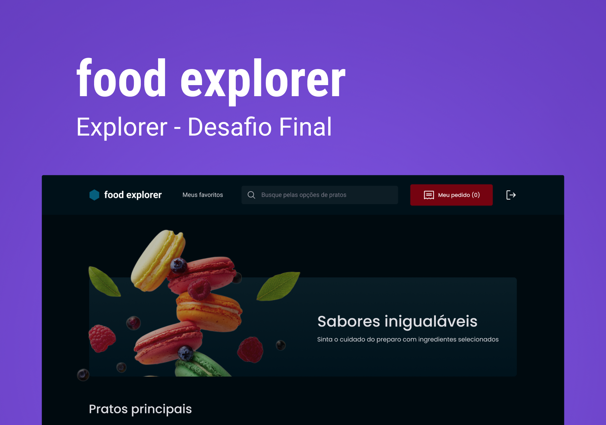

<h1 align="center">
	
</h1>

<h3 align="center">
  Food Explorer
</h3>

<p align="center">
🏁 RocketSeat's Explorer Course Final Project 🏁
</p>


<p align="center">
  
  <a href="https://www.linkedin.com/in/wenblack/">
    
  </a>
  
  <a href="https://github.com/wenblack/explorer-final-api/commits/master">
    
  </a>
  <a href="https://github.com/wenblack/explorer-final-api/issues">
    
  </a>
  
</p>

<p align="center">
  <a href="#-about-the-project">About the project</a>&nbsp;&nbsp;&nbsp;|&nbsp;&nbsp;&nbsp;
  <a href="#-technologies">Technologies</a>&nbsp;&nbsp;&nbsp;|&nbsp;&nbsp;&nbsp;
  <a href="#-getting-started">Getting started</a>&nbsp;&nbsp;&nbsp;|&nbsp;&nbsp;&nbsp;
  <a href="#-how-to-contribute">How to contribute</a>&nbsp;&nbsp;&nbsp;|&nbsp;&nbsp;&nbsp;
  <a href="#-license">License</a>
</p>

<p id="insomniaButton" align="center">
  <a href="" target="_blank"></a>
</p>

## 👨🏻‍💻 About the project

- <p style="color: red;">🏁 RocketSeat's Explorer Course Final Project 🏁</p>

To see the **web client**, click here: [PROJECT_NAME Web](https://github/wenblack/explorer-final-api)</br>
To see the **mobile client**, click here: [PROJECT_NAME Mobile](https://github/wenblack/explorer-final-api)

## 🚀 Technologies

Technologies that I used to develop this api

- [Node.js](https://nodejs.org/en/)
- [TypeScript](https://www.typescriptlang.org/)
- [Multer](https://github.com/expressjs/multer)
- [TypeORM](https://typeorm.io/#/)
- [JWT-token](https://jwt.io/)
- [Eslint](https://eslint.org/)
- [Prettier](https://prettier.io/)
- [EditorConfig](https://editorconfig.org/)

## 💻 Getting started

Import the `Insomnia.json` on Insomnia App or click on [Run in Insomnia](#insomniaButton) button

### Requirements

- [Node.js](https://nodejs.org/en/)
- [Yarn](https://classic.yarnpkg.com/) or [npm](https://www.npmjs.com/)

> Obs.: I recommend use Yarn for this Project.

**Clone the project and access the folder**

```bash
$ git clone https://github.com/wenblack/explorer-final-api.git && cd explorer-final-api
```

**Follow the steps below**

```bash
# Install the dependencies
$ yarn

# Create a .env file with a database location. Use example.env file like reference
 nano example.env

# Run the migrations and sending seeds
$ npx prisma migrate dev

# To finish, run the api service
$ yarn dev

# Well done, project is started!
```

## 🤔 How to contribute

**Make a fork of this repository**

```bash
# Fork using GitHub official command line
# If you don't have the GitHub CLI, use the web site to do that.

$ gh repo fork wenblack/explorer-final-api
```

**Follow the steps below**

```bash
# Clone your fork
$ git clone your-fork-url && cd explorer-final-api

# Create a branch with your feature
$ git checkout -b my-feature

# Make the commit with your changes
$ git commit -m 'feat: My new feature'

# Send the code to your remote branch
$ git push origin my-feature
```

After your pull request is merged, you can delete your branch

## 📝 License

This project is licensed under the MIT License - see the [LICENSE](LICENSE) file for details.

---

Made with 💜 &nbsp;by Wender Barbosa 👋 &nbsp;[See my linkedin](https://www.linkedin.com/in/wenblack/)